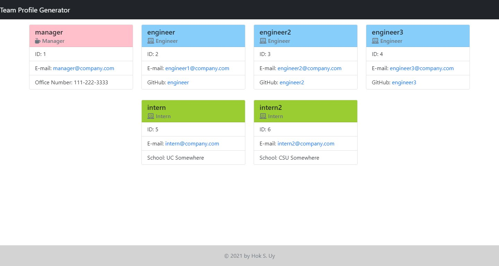

# Team Profile Generator

## Table of Contents
* [Description](#description)
* [Built With](#built-with)
* [Installation](#installation)
* [Usage](#usage)
* [Screenshot](#screenshot)
* [Contributing](#contributing-to-readme-generator)
* [Test](#test)
* [Questions](#questions)
* [License](#license)

## Description
This project is a Node.js application that runs in a shell that takes user input to generate a team profile in HTML. The application accepts user input to generate a Manager, Engineers, and Interns and created an HTML page to display the output.

See a preview of this application in action [here](https://drive.google.com/file/d/1p-C6sNkn8U5RVqPYREYDdxFSt_PmO2xr/view?usp=sharing).

## Built With
- Node.js
- Inquirer.js
- Bootstrap
- FontAwesome

## Installation
	git clone https://github.com/hsengu/team-profile-generator.git
	cd ./team-profile-generator
	npm install

## Usage
	npm start

## Screenshot

## Contributing to Team Profile Generator
Please follow contribution guidelines at the [Contributor Covenant](https://www.contributor-covenant.org/version/2/1/code_of_conduct/) to contribute to Readme Generator.

## Tests
    This application was tested using Jest running under Ubuntu 20.04 LTS on WSL2. YMMV.
    Usage:
	    npm test

## Questions
Contact me at the following:
- [hsengu's GitHub Profile](https://github.com/hsengu)
- hok.s.uy@hsengu.com

## License
This project is licensed under GNU GPL v3
